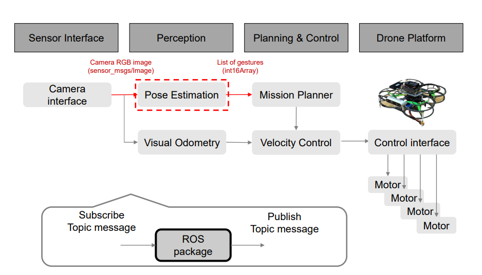

# Autonomous Gesture-controlled Drone

This project implements an autonomous drone system capable of responding to human gestures for various tasks such as approaching, taking photos, and returning to home position.

## Features

- Gesture recognition for drone control
- Autonomous navigation and obstacle avoidance
- Real-time image processing for human detection and tracking
- Mission planning and execution
- PID controller for smooth and stable flight

## System Architecture



## Prerequisites

- ROS Melodic
- OpenCV
- Eigen

## Installation

1. Clone the repository:
   ```
   git clone https://github.com/Sardor06/drone_control
   ```
2. Navigate to the project directory:
   ```
   cd AirGestureControl
   ```
3. Build the project:
   ```
   catkin_make
   ```

## Usage

1. Launch the main system:
   ```
   roslaunch mission_planner all.launch
   ```

## Demo


## Code Structure

- `mission_planner/`: Contains the main mission planning logic
  - `src/missionPlannerMain.cpp`: Implements the core mission planning algorithms
  - `src/behaviorControl.cpp`: Handles drone behavior and gesture responses
- `simple_pid_controller/`: Implements the PID controller for drone movement
  - `src/sub_goal_pid.cpp`: PID control implementation

## Contributing

We welcome contributions to improve the Autonomous Gesture-controlled Drone project.

## Contact

Sardor Atamurodov - sardoratamuradov2006@gmail.com

Project Link: [https://github.com/Sardor06/drone_control](https://github.com/Sardor06/drone_control)